目录
=================
 * [SSR 服务器搭建和使用指南](#ssr-服务器搭建和使用指南)
    * [Ubuntu/Debian 服务器配置](#ubuntudebian-服务器配置)
       * [下载安装 ssh](#下载安装-ssh)
       * [实现代理功能](#实现代理功能)
       * [开启 BBR 加速](#开启-bbr-加速)
    * [客户端下载和使用教程](#客户端下载和使用教程)
       * [Windows](#windows)
       * [MacOs](#macos)
       * [Linux](#linux)
       * [iOS](#ios)
       * [Android](#android)
    
# SSR 服务器搭建和使用指南
[](https://github.com/sosconf/SSR-Server/blob/master/LICENSE)
[](https://packages.debian.org/source/stretch-backports/linux)
[](https://github.com/teddysun/across/blob/master/bbr.sh)

```diff
- 本项目仅供学习和交流，严禁用于任何违法国家法律法规的用途
```
服务器配置指令在 Linux 系统通用，亲测油管 1080P 无压力。部分配置依赖第三方脚本，如有失效，请写 issue，我们看到将及时更新，谢谢！
## Ubuntu/Debian 服务器配置

> 建议以下命令均在 **root** 权限下运行

### 下载安装 ssh

打开终端执行如下命令，如果已经安装了 ssh 就直接跳到下一步即可:

```shell
apt-get unpdate
apt-get install openssh-server
```

在执行过程中会提示是否希望继续执行，选择 `y` 继续执行,下载完成之后启动 ssh:

```shell
/etc/init.d/ssh start # 启动ssh
```

关闭和重启命令如下:

```shell
/etc/init.d/ssh stop  # 关闭ssh
/etc/init.d/ssh restart  # 重启ssh
```

接下来配置 root 用户 ssh 服务:

```shell
nano /etc/ssh/sshd_config
```

键入 `Ctrl+w` 查找是否有 `PermitRootLogin yes` 内容。如果有，直接 `Ctrl+x` 退出即可(留意前面是否有 `#`)。

如果这一行前面有 `#`，那么需要删除 `#`，如果这一行内容为 `PermitRootLogin no`，那么需要修改 `yes` 为 `no`。

如果找不到这一行内容，直接在文档内添加即可。

完成后 `Ctrl+x`，然后键入 `y`，再键入 `enter` 即可保存并退出。

之后在客户端电脑(也就是自己的电脑)上执行以下命令，执行过程中一路 `enter` 即可。

```shell
ssh-keygen -t rsa
```

接下来进入 `/root/.ssh` 目录，将公钥上传至服务端(将 10.10.10.10 替换成自己的服务器地址)。

```shell
cd /root/.ssh # 进入/root/.ssh目录
scp id_rsa.pub root@10.10.10.10:/root
```

接下来在服务器端 `/root` 目录下创建 `.ssh` 文件夹(如果有就不需要创建了)，然后执行以下命令:

```shell
cd /root
mkdir .ssh
cat id_rsa.pub >>/root/.ssh/authorized_keys
chmod 600 /root/.ssh/authorized_keys
```

然后进入服务端 `/etc/ssh` 目录，打开 `sshd_config`:

```shell
vim cd /etc/ssh/sshd_config
```

修改或启用以下内容:

```txt
RSAAuthentication yes # 开启rsa验证
PubkeyAuthentication yes # 是否使用公钥
AuthorizedKeysFile .ssh/authorized_keys # 公钥保存位置
PasswordAuthentication no # 禁止使用密码登录
```

之后重启 ssh:

```shell
service sshd restart
# 或者使用以下命令
/etc/init.d/ssh restart  # 重启ssh
```

接下来就可以用客户端电脑通过 ssh 密钥的方式登录服务器了(将 10.10.10.10 替换成自己的服务器 ip 地址):

```shell
ssh root@10.10.10.10
```

### 实现代理功能

登录服务器后执行以下命令:

```shell
wget -N --no-check-certificate https://raw.githubusercontent.com/ToyoDAdoubi/doubi/master/ssrmu.sh && chmod +x ssrmu.sh && bash ssrmu.sh

```

然后依照提示依次配置即可(未安装过 SSR 的服务器在第一个提示出现时输入 1)。

在提示设置端口的时候可以用默认的,也可以用自己的,但是切记不要使用1080以前的端口,建议 3000-30000 之间。

设置完成后等待几分钟就好了。

> 具体可以查看此链接:[配置SSR](https://www.textarea.com/vultr/shoubashou-jiao-ni-dajian-shadowsocksr-kexue-shangwang-dajian-ssr-jiaocheng-shiyong-yu-suoyou-linux-zhuji-1046)

### 开启 BBR 加速

在服务器 `root` 账号下执行以下命令:

```shell
wget --no-check-certificate https://github.com/teddysun/across/raw/master/bbr.sh && chmod +x bbr.sh && ./bbr.sh
```

安装过程中可能提示需要重启 `VPS`，输入 `y` 即可，如果没有出现也不用关心。

## 客户端下载和使用教程
目前提供给大家 5 大常见平台的客户端的下载和使用教程。
### Windows
1. 点击下载 [ShadowsocksR](https://github.com/sosconf/SSR-Server/raw/master/Downloads/ShadowsocksR-win-4.9.2.rar) 并安装。
2. 根据 `.NET Framework` 的版本决定启动哪个版本的 EXE 文件，一般 PC 选择启动 **ShadowsocksR-dotnet4.0**。
<p align="center"></p>

3. 在托盘栏右键小飞机，**服务器** -> **编辑服务器** -> **添加**，填写 SOSConf 提供的服务器信息并保存即可。
<p align="center"></p>
<p align="center">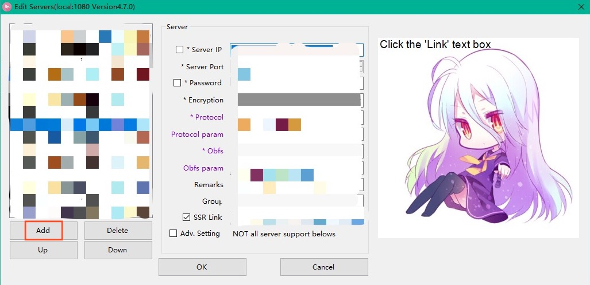</p>

4. 将**系统代理模式**改成**全局模式**。测试一下是否能访问油管。
<p align="center"></p>

5. 如测试成功，记得在**选项设置**中打勾**开机启动**并关闭**负载均衡**。从此开始享受酸酸乳带来的快乐生活～
<p align="center">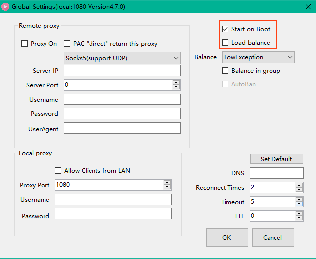</p>

### MacOs
1. 点击下载 [ShadowsocksX-NG-R8](https://github.com/sosconf/SSR-Server/blob/master/Downloads/ssr-mac.dmg) 并安装。
2. 一路默认安装，在**安全性与隐私**时选择**仍要打开**并点击**打开**。

3. 在任务栏右键小飞机，**服务器** -> **编辑服务器** -> **添加**，填写 SOSConf 提供的服务器信息并保存即可。
<p align="center">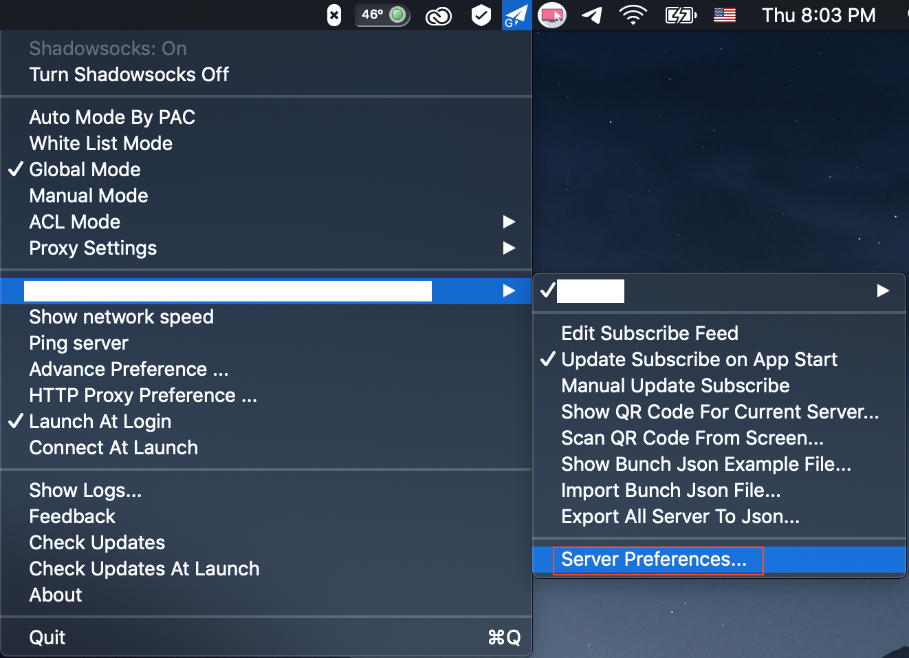<span style="display:block;">&emsp;&emsp;&emsp;&emsp;</span></p>

4. 在**系统代理模式**改成**全局模式**。点击**打开 Shadowsocks**。测试一下是否能访问油管。
<p align="center">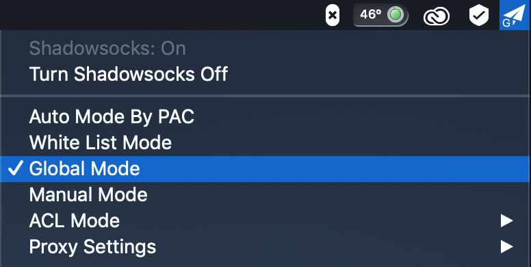<span style="display:block;">&emsp;&emsp;&emsp;&emsp;</span>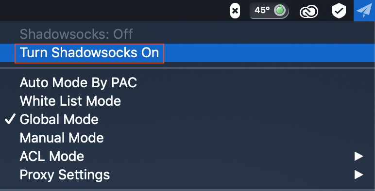</p>

5. 如测试成功，记得右键小飞机点击**登录时自动启动**。从此开始享受酸酸乳带来的快乐生活～
<p align="center"></p>

### Linux
1. 点击下载 [Electron-SSR](https://hexang.org/miaocai/linux-ssr-client/raw/master/downloads/electron-ssr_0.2.3_amd64.deb) 并安装。
2. 在任务栏右键小飞机，**服务器** -> **编辑服务器** -> **添加**，填写 SOSConf 提供的服务器信息并保存即可。
<p align="center">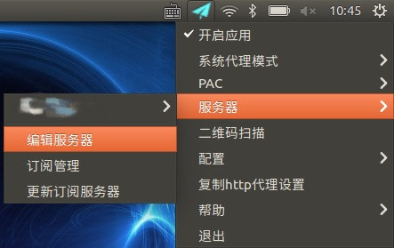</p>
<p align="center"></p>

3. 在**系统代理模式**改成**全局模式**。点击**打开应用**。测试一下是否能访问油管。
<p align="center"><span style="display:block;">&emsp;&emsp;&emsp;&emsp;</span></p>

4. 如测试成功，记得右键小飞机点击**配置** -> **选项配置** -> **开机启动**。从此开始享受酸酸乳带来的快乐生活～
<p align="center">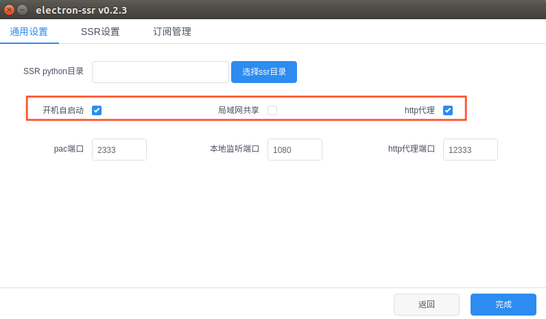</p>

### iOS
1. 前往非国区 Apple Store 下载 **Shadowrocket** 并安装，SOSConf 志愿者如有需要请找**技术组**要备用账号。
2. 打开应用，点击右上方的加号，**类型** -> **ShadowsocksR**，填写 SOSConf 提供的服务器信息并保存即可。
<p align="center"><span style="display:block;">&emsp;&emsp;&emsp;&emsp;</span></p>

<p align="center">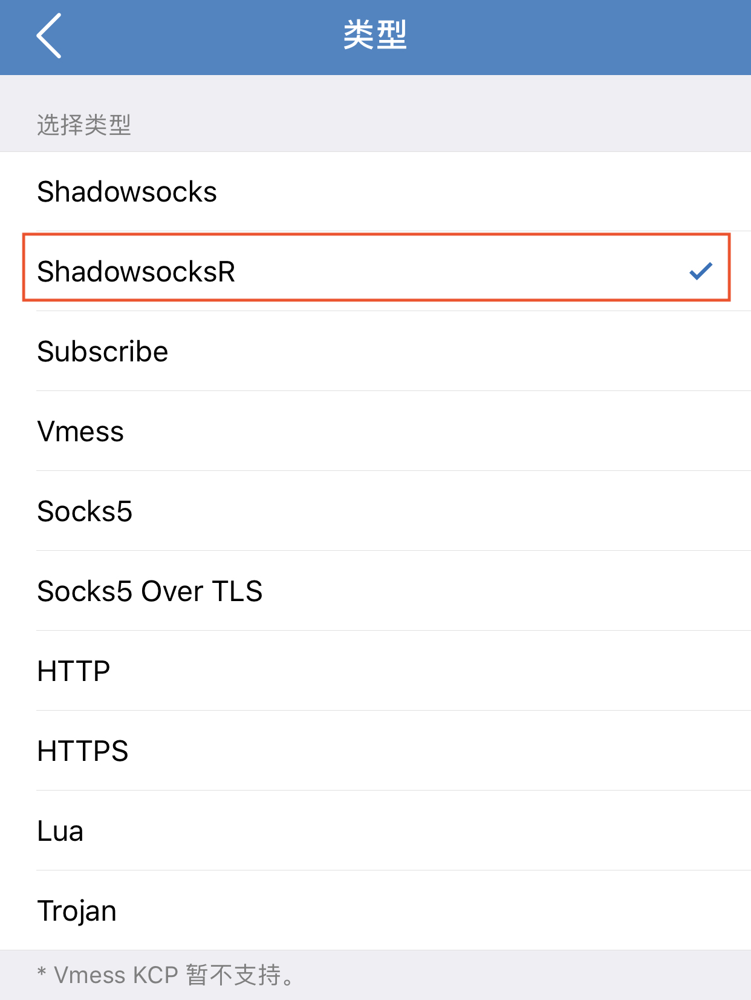<span style="display:block;">&emsp;&emsp;&emsp;&emsp;</span>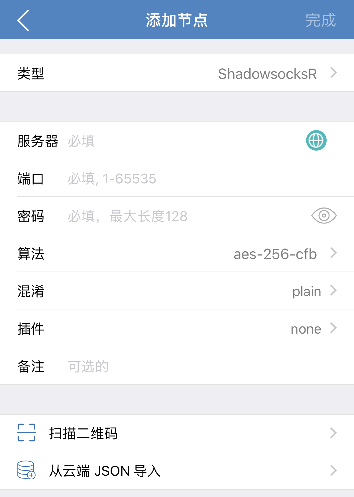</p>

3. 在**系统代理模式**改成**全局模式**。选中配置好的服务器节点，点击小火箭那栏的按钮，蓝色表示开启。测试一下是否能访问油管。
<p align="center">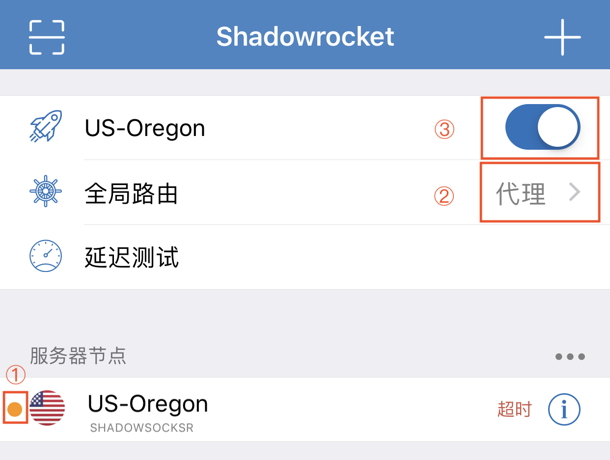</p>

4. 如测试成功，从此开始享受酸酸乳带来的快乐生活～
### Android
1. 点击下载 [ShadowsocksR](https://github.com/sosconf/SSR-Server/blob/master/Downloads/ssr-android.apk) 并安装。
2. 打开应用程序，点击左上角的 **Shadowsocks R**，向右滑动删除默认连接。
<p align="center"></p>

3. 点击右下角的 **+** 号按钮，点击**手动设置**，填写 SOSConf 提供的服务器信息并保存更新即可。
<p align="center">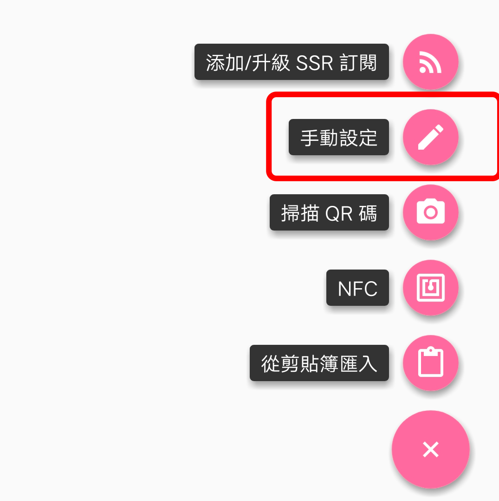</p>

4. 返回主页面，下滑找到**功能设置**。关闭**IPv6路由**，**分应用代理**，**UDP转发**。
<p align="center"></p>

5. 完成配置后，点击右上角的小飞机标志并在弹出窗口点击**确定**。测试一下是否能访问油管。
<p align="center">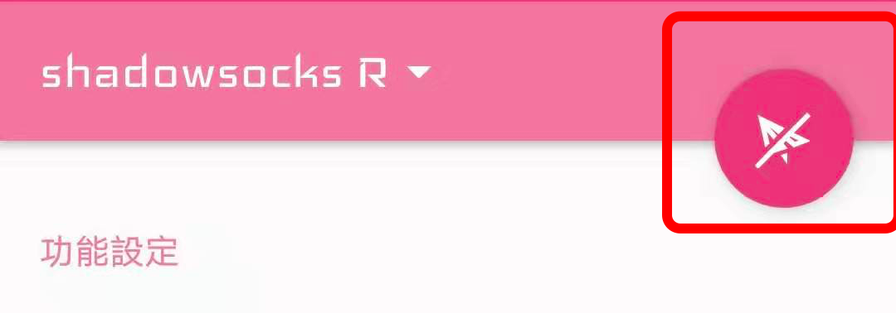</p>

6. 如测试成功，从此开始享受酸酸乳带来的快乐生活～
